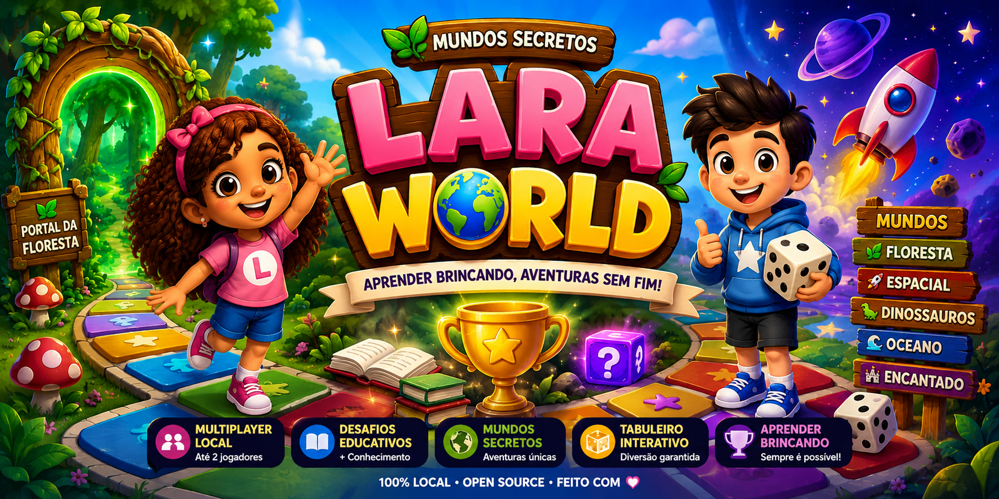
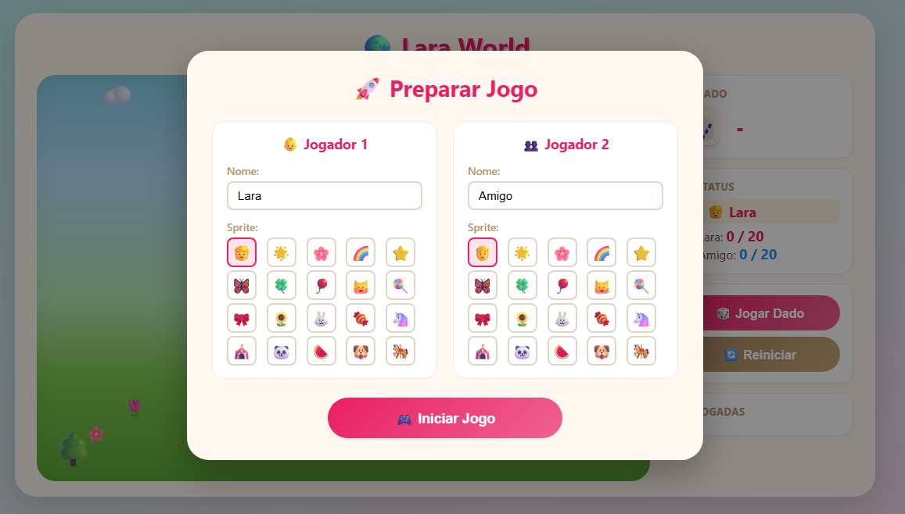
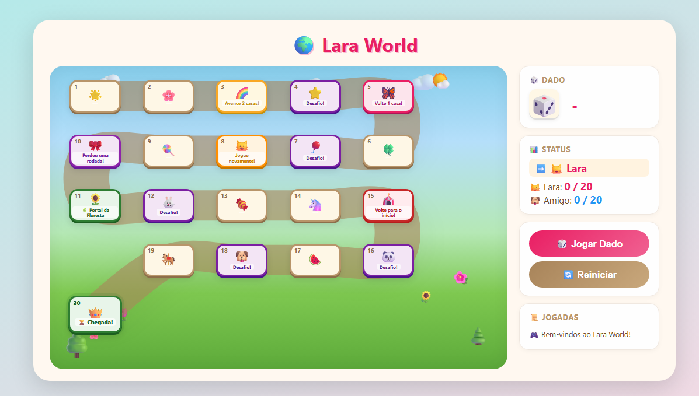
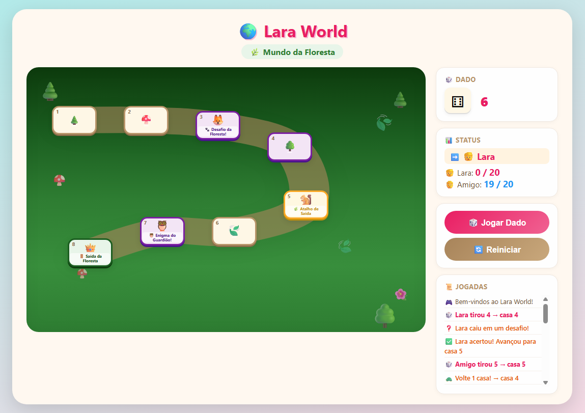
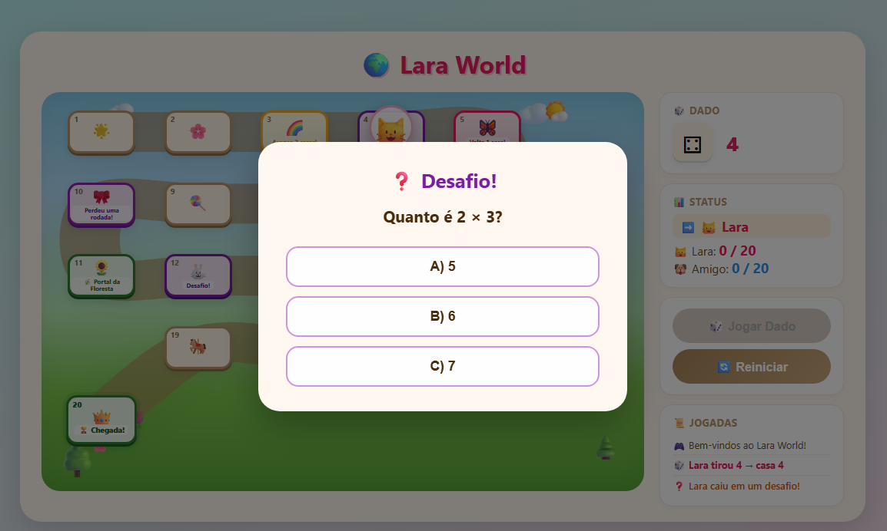

<p align="center">
  
</p>
  
# 🌍 Lara World

**Lara World** é um jogo de trilha infantil para navegador, onde os jogadores percorrem um caminho de 20 casas até a linha de chegada. Feito com HTML, CSS e JavaScript puro — sem frameworks, sem backend, sem banco de dados.

## 🌐 Demo Online

👉 **Acesse a demonstração:** https://lara-world.wl-infra.uk/

⚠️ Recomendado jogar em computador ou tablet para melhor experiência.

---

## 📌 Status do Projeto

| Versão | Data | Status |
|--------|------|--------|
| **v0.10.0-preview** | Jul/2026 | ✅ **Ativo** |
| v0.9.0-preview | Jul/2026 | ✅ Concluído |
| v0.8.0 | Jul/2026 | ✅ Concluído |
| v0.7.0 | Jul/2026 | ✅ Concluído |
| v0.6.0 | Jul/2026 | ✅ Concluído |
| v0.5.0 | Jul/2026 | ✅ Concluído |
| v0.4.0 | Jul/2026 | ✅ Concluído |
| v0.3.0 | Jul/2026 | ✅ Concluído |
| v0.2.0 | Jul/2026 | ✅ Concluído |
| v0.1.0 | Jul/2026 | ✅ Concluído |

---

## ✨ Funcionalidades Atuais (v0.10.0-preview)

### Seletor de Mundos

- **Tela de seleção de mundo** — após clicar em "⚡ Jogo Rápido", 6 cards de mundos são exibidos (Floresta, Dinossauros, 3 "Em breve" bloqueados, Aleatório)
- **🌳 Floresta Encantada** — mundo com 20 casas, desafios educativos e portal para Área Especial (Floresta Misteriosa)
- **🦖 Vale dos Dinossauros** — segundo mundo disponível, com 20 casas, desafios educativos e portal para Área Especial (Caverna dos Fósseis)
- **🌲 Área Especial (Floresta Misteriosa)** — submundo de 8 casas acessado pelo portal da Floresta, com desafios próprios e retorno parametrizado
- **🦴 Área Especial (Caverna dos Fósseis)** — submundo de 8 casas acessado pelo portal do Vale, com desafios próprios e retorno parametrizado
- **Mundo Aleatório** — seleciona um mundo aleatório entre os disponíveis
- **Cards "Em breve"** — visualmente bloqueados com badge "🔒 Em breve", sem ação ao clicar

### Menu Inicial

- **Tela inicial** — ao abrir o jogo, um menu principal com título e botões é exibido
- **⚡ Jogo Rápido** — inicia uma partida no modo Single Player (Humano vs Máquina) com configuração simplificada
- **🏆 Modo Carreira (Em Breve)** — botão desabilitado visualmente, reservado para futura progressão com fases e pontuação

### Modo Single Player (Humano vs Máquina)

- **Seletor de modo** — ao abrir o modal de configuração, escolha entre "👥 2 Jogadores" ou "👤 1 Jogador"
- **Modo 1 Jogador** — você controla o Jogador 1; o Jogador 2 é controlado pela máquina (🤖)
- **Configuração simplificada** — no modo 1 jogador, apenas o nome e sprite do Jogador 1 são solicitados
- **Bot automático** — a máquina joga sozinha após 1 segundo de espera, com jogada completa (dado, movimento, casas especiais)
- **Desafios do bot** — o bot responde desafios educativos com 60% de chance de acerto
- **Portal do bot** — o bot decide entrar no Portal da Floresta com 50% de chance
- **Alternância automática** — os turnos alternam normalmente entre humano e máquina

### Tela de Vitória

- **Overlay de vitória** — ao vencer, uma tela com confetes animados, fogos serpentina e troféu é exibida
- **Mensagem personalizada** — exibe o nome e emoji do jogador vencedor
- **Botão "🔁 Jogar Novamente"** — reinicia a partida no mesmo modo (Jogo Rápido mantém single player)
- **Botão "🏠 Voltar ao Menu"** — retorna ao menu inicial para escolher outro modo

### Sistema de Mundos e Áreas Especiais

- **Dois mundos completos** — 🌳 Floresta Encantada e 🦖 Vale dos Dinossauros, cada um com 20 casas, eventos e portal próprio
- **Áreas Especiais** — cada mundo pode conter uma área especial (submundo) acessada via portal:
  - 🌲 **Floresta Misteriosa** (submundo da Floresta) — 8 casas, mini-trilha com visual temático
  - 🦴 **Caverna dos Fósseis** (submundo do Vale) — 8 casas, mini-trilha com visual temático
- **Portal** — casa específica que abre modal perguntando se deseja entrar na Área Especial
- **Modal de entrada** — ao cair na casa do portal, um modal oferece "Entrar" ou "Continuar"
- **Jogador ativo na área especial** — apenas o jogador que entrou joga na área
- **Outro jogador oculto** — o sprite do outro jogador não aparece no tabuleiro da área
- **Turno bloqueado** — o turno não alterna enquanto o jogador estiver na área especial
- **Casas especiais próprias** — cada área define seus próprios eventos (desafios, atalhos, saída)
- **Posição salva por jogador** — cada jogador tem sua própria posição de entrada na área
- **Retorno parametrizado** — ao sair, o jogador avança `bonusCells` (definido no WorldConfig) a partir da posição de entrada
- **Retorno sem cascata** — ao voltar ao mundo principal, o bônus não dispara outras casas especiais
- **Modo debug** — ativado por `?debug=1` na URL, exibe painel com botões para teste rápido de cada área
- **Portal genérico** — a engine não conhece nomes de mundos ou áreas; toda navegação é baseada em configuração (`targetWorldId`, `bonusCells`, etc.)

---

## 📸 Screenshots

### 🎮 Configuração dos Jogadores



### 🌍 Mundo Principal



### 🌿 Mundo da Floresta



### 📚 Desafios Educativos



---

### Funcionalidades Anteriores

- **Banco de questões** — 30 perguntas organizadas em 6 categorias (Matemática, Português, Animais, Espaço, Natureza, Dinossauros)
- **Sorteio aleatório** — a pergunta exibida é sorteada do banco, não fixa por casa
- **Sem repetição na partida** — o jogo evita repetir a mesma pergunta até que todas sejam usadas
- **Reinício automático do banco** — quando todas as perguntas forem utilizadas, o ciclo recomeça
- **5 casas de desafio educativo** no mundo principal (casa 4, 7, 12, 16, 18)
- **Modal de desafio** — ao cair em uma casa de desafio, um modal com pergunta e 3 alternativas é exibido
- **Acerto/erro com movimento** — resposta correta: avança 1 casa; resposta errada: volta 1 casa
- **Bloqueio do dado durante desafio** — o botão "Jogar Dado" permanece desabilitado até o desafio ser respondido
- **Prevenção de loop infinito** — o movimento pós-desafio não cascateia para outras casas especiais
- **Modal de configuração inicial** — tela de setup com nome e sprite para cada jogador antes da partida
- **Nomes personalizados** — Jogador 1 e Jogador 2 com campos de texto editáveis
- **Sprites independentes** — grade de emojis exclusiva para cada jogador, sem compartilhamento de estado
- **Inicialização pelo modal** — o tabuleiro só é carregado após clicar em "Iniciar Jogo"
- **Reinício retorna ao modal** — ao reiniciar, o jogador pode alterar nomes e sprites novamente
- **Tabuleiro visual em trilha** — 20 casas posicionadas em snake pattern com caminho SVG suave
- **Movimento animado** — personagens andam casa por casa com animação pulse (180ms/passo)
- **Sistema de dado** — dado virtual 1-6 com animação de rolagem (bounce)
- **12 casas especiais no mundo principal** com efeitos automáticos:
  - Casa 3 → Avance 2 casas
  - Casa 4 → Desafio educativo
  - Casa 5 → Volte 1 casa
  - Casa 7 → Desafio educativo
  - Casa 8 → Jogue novamente
  - Casa 10 → Perde uma rodada
  - **Casa 11 → 🌿 Portal da Floresta**
  - Casa 12 → Desafio educativo
  - Casa 15 → Volte ao início
  - Casa 16 → Desafio educativo
  - Casa 18 → Desafio educativo
  - Casa 20 → Vitória
- **Multiplayer local** — 2 jogadores no mesmo dispositivo
- **Alternância automática de turnos** — após cada jogada, o turno passa para o próximo jogador
- **Destaque visual do jogador ativo** — indicador de turno no painel
- **Histórico de jogadas** — registro cronológico de todas as ações
- **Sistema de vitória** — o primeiro a chegar ou ultrapassar a casa 20 vence
- **Design responsivo** — adaptado para desktop e notebook
- **Docker + Nginx** — ambiente conteinerizado para deploy

---

## 🎮 Como Jogar

### Configuração Inicial

1. Abra o jogo no navegador — a **Tela Inicial** é exibida com o título Lara World.
2. Clique em **"⚡ Jogo Rápido"** para iniciar uma partida single player.
3. O **modal de configuração** é exibido para definir nome e sprite do Jogador 1.
4. Clique em **"Iniciar Jogo"** para começar a partida.

### Modo 2 Jogadores (Multiplayer)

1. O jogo inicia com o **Jogador 1** (configurado no modal).
2. Clique em **"Jogar Dado"** para lançar o dado.
3. O personagem avança o número de casas sorteado — andando casa por casa com animação.
4. Casas especiais podem fazer você avançar, voltar, perder rodadas, jogar novamente ou **responder a um desafio educativo** (casas 4, 7, 12, 16, 18).
5. Ao cair em uma casa de desafio, um modal com pergunta sorteada do **Banco de Questões** (6 categorias, 30 perguntas) aparece. Acertar = avança 1 casa; errar = volta 1 casa. O jogo evita repetir perguntas na mesma partida.
6. Após cada jogada, o turno alterna automaticamente para o outro jogador.
7. Se os dois jogadores estiverem na mesma casa, os personagens aparecem lado a lado.
8. **O primeiro a atingir ou ultrapassar a casa 20 vence** a partida.
9. Para uma nova partida, clique em **"Reiniciar"** — o modal de configuração reaparece para ajustar nomes e sprites.

### Modo 1 Jogador (Humano vs Máquina)

1. O jogo inicia com o **Jogador 1** (você) no turno.
2. Clique em **"Jogar Dado"** para lançar o dado — seu personagem avança e ativa casas especiais.
3. Após sua jogada, o turno alterna para a **Máquina** (🤖), que joga automaticamente após 1 segundo.
4. A máquina realiza a jogada completa: dado, movimento, casas especiais, desafios e portal.
5. **Desafios da máquina**: o bot responde com 60% de chance de acerto — sem modal, resolvido em 600ms.
6. **Portal da máquina**: o bot decide entrar no Portal da Floresta com 50% de chance — decidido em 500ms.
7. Os turnos alternam entre você e a máquina até alguém atingir a **casa 20**.
8. Para uma nova partida, clique em **"Reiniciar"** — o modal de configuração reaparece.

---

## 🛠️ Tecnologias

| Tecnologia | Versão | Função |
|------------|--------|--------|
| HTML5 | — | Estrutura da página |
| CSS3 | — | Estilização, layout flex, animações |
| JavaScript | ES6+ | Lógica do jogo (IIFE, async/await, Promises) |
| Nginx | alpine | Servidor web para deploy |
| Docker | — | Conteinerização |

---

## 📜 História do Projeto

O Lara World começou como um MVP de tabuleiro simples para 1 jogador. A primeira versão (v0.1.0) implementou a lógica básica do jogo com dados, casas especiais e Docker. Na sequência (v0.1.5) recebeu um tabuleiro visual com trilha serpentina, personagem animado e painel lateral. A versão v0.2.0 adicionou multiplayer local com alternância de turnos entre 2 jogadores. A v0.3.0 introduziu o modal de configuração inicial com nomes e sprites personalizáveis. A v0.4.0 adicionou 5 casas de desafios educativos com perguntas de múltipla escolha. A v0.5.0 substituiu as perguntas fixas por um **Banco de Questões** com 30 perguntas. A v0.6.0 adicionou o **Mundo da Floresta** com portal na casa 11, sistema de portais, mini-trilha de 8 casas com mecânicas exclusivas e modo debug. A v0.7.0 adicionou o **modo Single Player (Humano vs Máquina)** com bot inteligente, tela de vitória com confetes e correções de cascata. A v0.8.0 adicionou um **Menu Inicial** com opções "⚡ Jogo Rápido" (single player) e "🏆 Modo Carreira (Em Breve)", além de uma tela de vitória com dois botões de saída (Jogar Novamente e Voltar ao Menu). A v0.9.0-preview iniciou a **Fase de Mundos** com seletor de mundos, motor modular (SessionManager, StateManager, WorldRegistry, EventProcessor) e o primeiro WorldConfig (Floresta Encantada + Floresta Misteriosa). A versão atual (v0.10.0-preview) consolida o **primeiro ecossistema multi-mundos** com a integração completa do Vale dos Dinossauros, da Caverna dos Fósseis, portal genérico baseado em configuração, Theme Engine em produção e debug independente para cada área.

---

## 🚀 Desenvolvimento Local

> ⚠️ A partir da Sprint A5.1 (`v0.9.0-preview`) o `game.js` foi migrado de um script global para **ES Module** (`<script type="module">`).
> Por segurança, navegadores bloqueiam módulos ES quando a página é aberta pelo protocolo `file://`.
> **É obrigatório usar um servidor HTTP local.**

### Opção 1 — Servidor local (Python)

```bash
cd src
python3 -m http.server 8000
```

Acesse: http://localhost:8000

### Opção 2 — Servidor local (Node.js)

```bash
cd src && npx serve .
```

Acesse: http://localhost:3000

---

## 🐳 Como Executar com Docker

### Pré-requisitos

- Docker
- Docker Compose

### Passos

```bash
# Clone o repositório
git clone https://github.com/wellingtonhzt/lara-world-game.git
cd lara-world

# Build e execução
docker compose up -d
```

Acesse: http://localhost:8080

### Parar o container

```bash
docker compose down
```

---

## 🗺️ Roadmap

- **v0.9.0-preview** — ✅ Concluído — Seletor de mundos, motor modular, primeiro WorldConfig
- **v0.10.0-preview** — ✅ **Ativo** — Vale dos Dinossauros, Caverna dos Fósseis, portal genérico, Theme Engine
- **v1.0.0** — Lançamento oficial

Veja o [roadmap completo](docs/roadmap.md).

---

## 🤖 Desenvolvimento Assistido por IA

Este projeto segue o processo definido em [docs/AI_WORKFLOW.md](docs/AI_WORKFLOW.md), que estabelece um fluxo obrigatório de implementação, validação, documentação e memorial técnico para toda evolução futura.

---

## 📄 Licença

Este projeto é open source e está sob a licença MIT.
